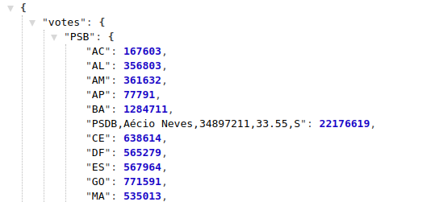

# Eleições 2014

Este projeto tem como missão visualizar alguns dados sobre votos das eleições de 2014.

## Iniciando o projeto
Simplesmente utilize o docker-compose para rodar este projeto, digitando o comando na raíz do projeto.

```
docker-compose up
```

## API

A api está sob a pasta `/back` e roda sob a porta `4000`.

### Rotas:

#### Votos por partidos e estados:

```http://localhost:4000/api/eleicao/2014/presidente/primeiro-turno/estados```

#### Votos agrupados por estado e município

```http://localhost:4000/api/eleicao/2014/presidente/primeiro-turno/estados/{municipio}/municipios```

O {municipio} pode ser um id ou uf ex: `33` ou `rj` se referem ao rio de janeiro.

>Obs: Existe um bug nos dados em que aparece uma chave como `PSDB,Aécio Neves,34897211,33.55,S`, ainda não consegui localizar esse inseto.



## Front 

O projeto de visualização dos dados está sob a basta `/front` e roda sob a porta `3000`.

```
  http://localhost:3000
```

>Obs: a unica funcionalidade implementada foi a visualização por estados, a funcionalidade de visualização por municípios não foi implementada ainda por questões de tempo, porém, a api já retorna os dados necessários.

## Possíveis melhorias
- Ao invés do cache ficar em memória, seria interessante colocar um redis (em um sistema de produção, por exemplo).
- Pasta compartilhada para os tipos das aplicações (principalmente respostas da api)
- Aumentar a cobertura de testes (as engines estão configuradas, porém, existem poucos testes escritos).
- Melhorar o tratamento de erros.